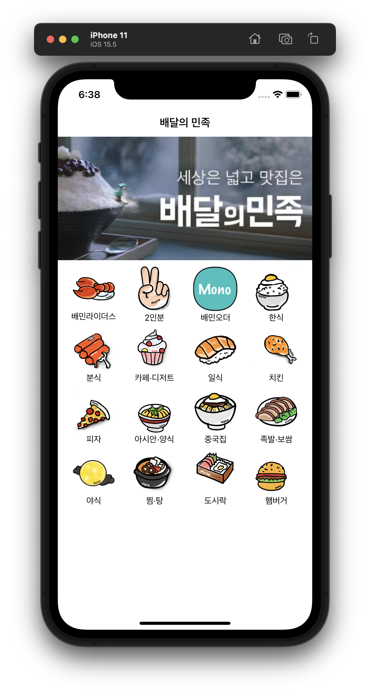

# Delivery App (배달의 민족 따라잡기)

 

### 1주차 (220704 ~ 220708)

`메인 화면`

- UI 구성 (메인 화면, 회원가입 화면)
- 오토레이아웃 설정

> 프로젝트 생성 및 오토레이아웃 연습을 했다. 각 Category Item은 ImageView와 Label을 View에 embed 시켜서 레이아웃을 구성했고, 각 Item을 StackView로 감싸서 총 4개의 Row로 구성하였다. 마지막으로 그 Horizontal StackView를 Vertical StackView로 한 번 더 감싸주었다.
