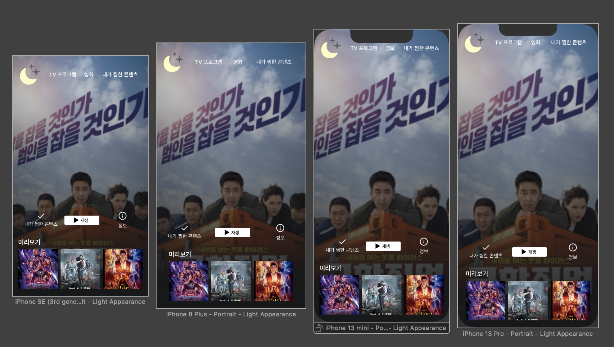

# Movie App (Netflix 따라잡기)

 

 

### 1주차 (220704 ~ 220708)

`메인 화면`

- UI 구성 (메인 화면, 회원가입 화면)
- 스토리보드 및 코드로 속성 조정
- IBOutlet, IBAction, IBOutlet Collection 연결
- 버튼 클릭 시 이미지 랜덤 표시
- 이미지 Corner Radius 설정
- 오토레이아웃 설정

`회원가입 화면`

- UI 구성
- 코드로 속성 조정
- 키보드 내리기
- TextField 필드 조건 판단
- 오토레이아웃 설정
